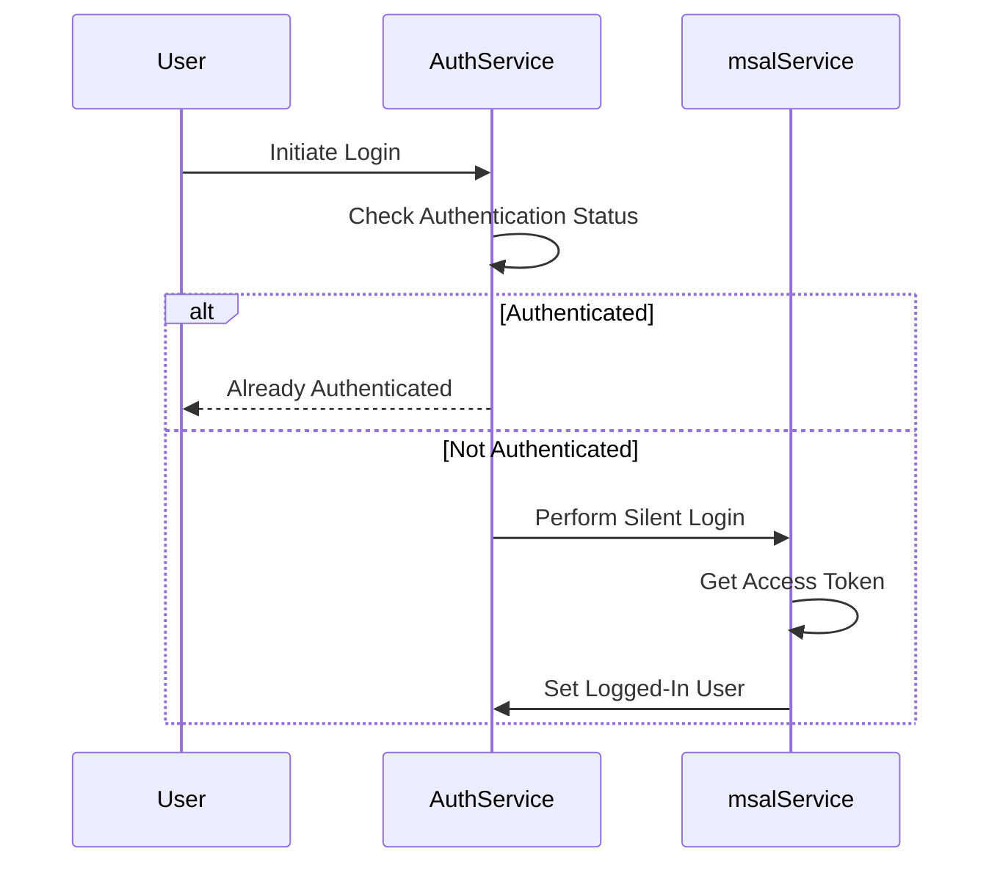
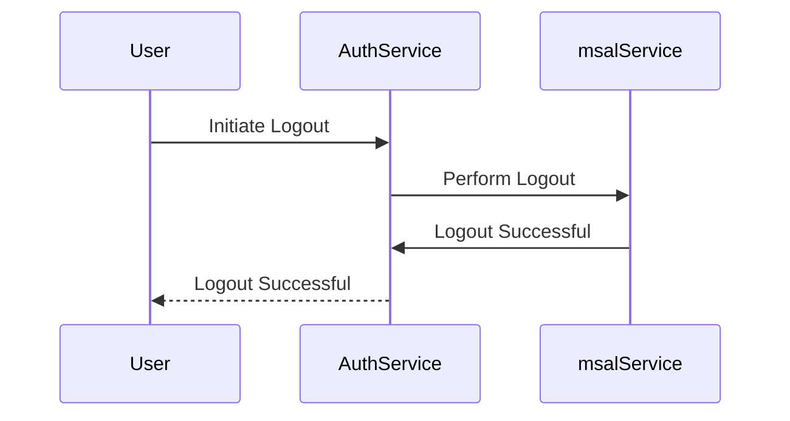
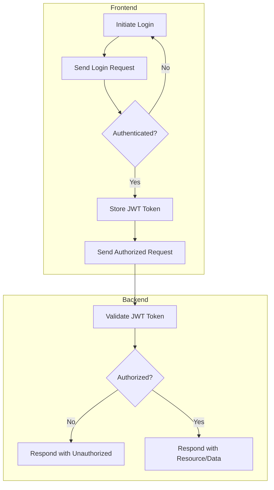

### Login flow (FE --> AZURE AD) Sequence Diagram

```mermaid
sequenceDiagram
    participant User
    participant AuthService
    participant msalService

    User->>AuthService: Initiate Login
    AuthService->>AuthService: Check Authentication Status
    alt Authenticated
        AuthService-->>User: Already Authenticated
    else Not Authenticated
        AuthService->>msalService: Perform Silent Login
        msalService->>msalService: Get Access Token
        msalService->>AuthService: Set Logged-In User
    end

```

### Logout flow (FE --> AZURE AD) Sequence Diagram

```mermaid
sequenceDiagram
    participant User
    participant AuthService
    participant msalService

    User->>AuthService: Initiate Logout
    AuthService->>msalService: Perform Logout
    msalService->>AuthService: Logout Successful
    AuthService-->>User: Logout Successful

```

### Authentication/Authorization FLOW between FE --> BE (OMNI JAVA) Flowchart

```mermaid
graph TD
    subgraph "Frontend"
        A[Initiate Login] --> B[Send Login Request]
        B --> C{Authenticated?}
        C -- No --> A
        C -- Yes --> D[Store JWT Token]
        D --> E[Send Authorized Request]
    end
    subgraph "Backend"
        E --> F[Validate JWT Token]
        F --> G{Authorized?}
        G -- No --> H[Respond with Unauthorized]
        G -- Yes --> I[Respond with Resource/Data]
    end

```
